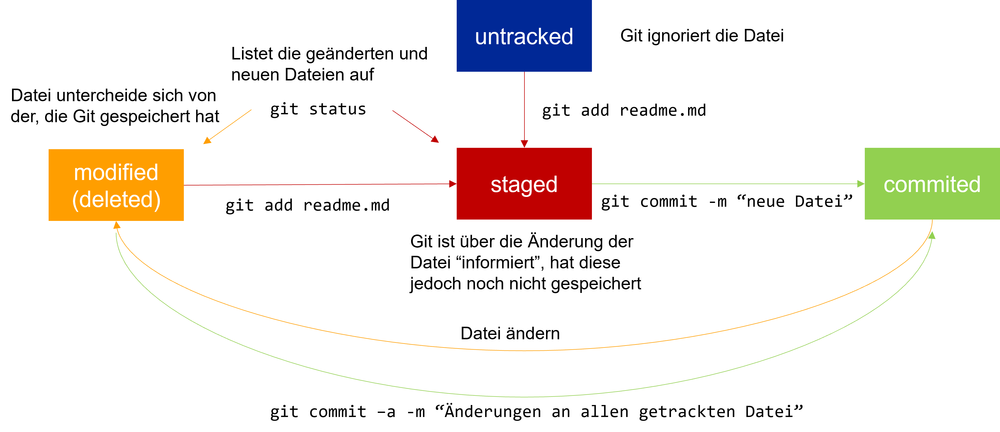
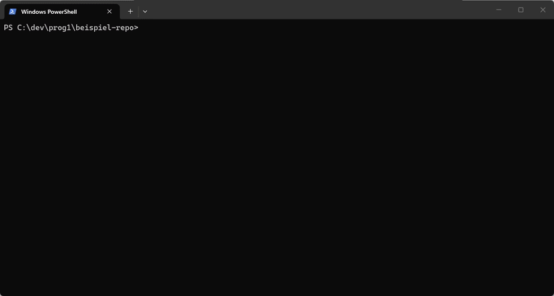
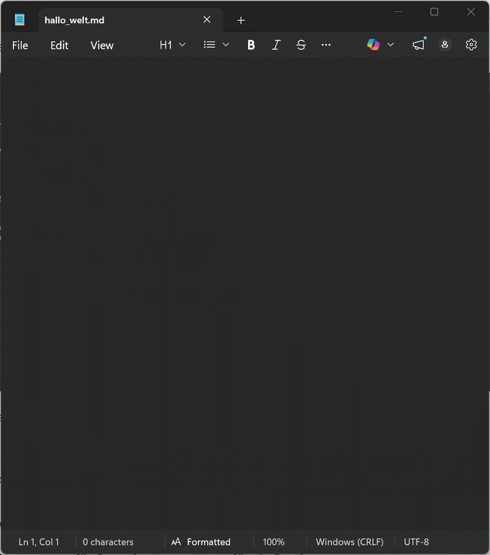
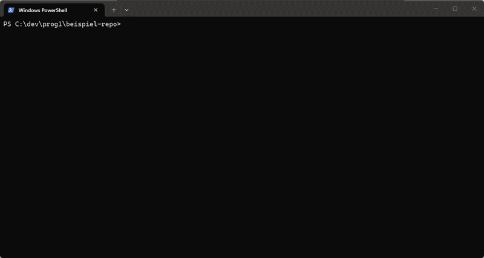
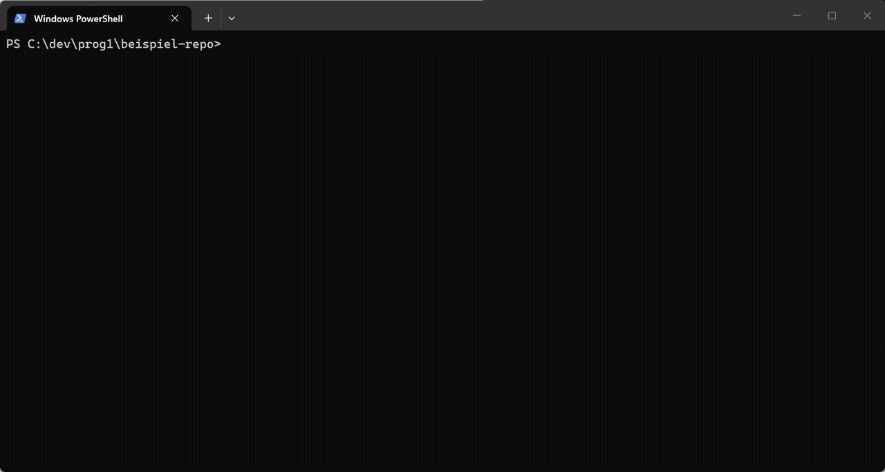
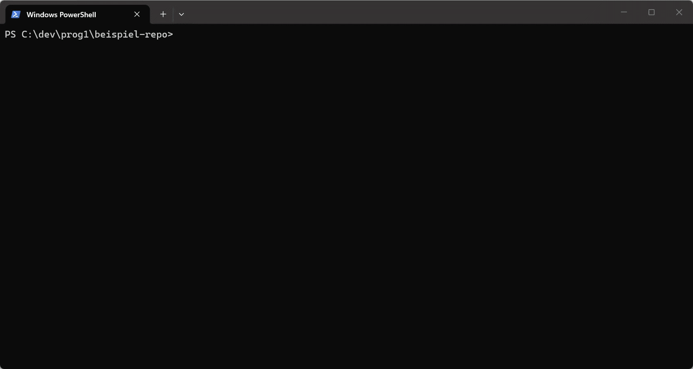

# Git

## Voraussetzungen

Bis zum Beginn der Einheit, stelle bitte sicher, dass folgende Voraussetzungen erfüllt sind:

* Auf deinem Rechner ist Java in der aktuellen Version installiert&#x20;
* Du konntest Dein erstes Java Programm kompilieren&#x20;
* Auf deinem Rechner ist Git installiert

## Lernziele

Nach dieser Einheit sollst Du:

1. Ein **Git Repository** **clonen** & lokal entwickeln können
2. Einen eigenen **Feature Branch anlegen** und **pushen**
3. Sinnvolle **Commit-Messages** schreiben
4. Ein minimales Java-Projekt kompilieren und ausführen können
5. Eine **CI Pipeline triggern** **und** den **Status interpretieren** lernen

##

##

## Was ist Git&#x20;

### tl;dr ?

* Git ist ein [Versionsverwaltungssystem](einheit-1-git/versionsverwaltungssystem.md)
* Es ermöglicht paralleles Arbeiten an Quell-Code
* Es ermöglicht Nachvollziehbarkeit aller Änderungen
* Es ermöglicht das Sichern eines Projektzustandes und
* Es stellt ein Werkzeug modernen Software-Entwicklung

### Grundbefehle

```
git clone <url>
git status
git add <files>
git commit -m "Message"
git push
```

<figure><figcaption></figcaption></figure>

### Git Grundlagen

* **Git Repository**: Vereinfacht ausgedrückt, ein Verzeichnis, in dem die Dateien “überwacht” werden
* Metadaten (einschl. der Historie) werden in einem versteckten Unterverzeichnis `.git` verwaltet.
* Git ist eine verteilte Versionsverwaltung, d.h. es gibt Notwendigkeit eines zentralen Repositories
* **Clonen** bzw. **Forken** eines Repositories legt eine vollständige Kopie an. Änderungen können dann in das ursprüngliche Repository zurückgeführt (engl. merge) werden.
* Jede Datei in dem überwachten Verzeichnis, befindet sich in einem bestimmten Zustand:
* Neue Dateien werden von Git als untracked file markiert und vorerst vbon GIt ignoriert.&#x20;
* Neue Dateien (und Änderungen an Dateien) müssen Git mit dem Befehl `git add` angezeigt werden - erst dann werden diese Änderungen in Git nachvollzogen.
* Erst mit einem `git commit` wird die Änderung an der Datei im persistiert - also in Git nachvollziehbar gemacht.&#x20;

## Übungen - Lokales Git Repository erstellen

1. Öffne das Terminal auf deinem Rechner und erstelle ein Verzeichnis:&#x20;

```
C:\dev\prog1\beispiel-repo
```

bzw.

```
\dev\prog1\beispiel-repo
```

Wechsel nun in das Verzeichnis und erstelle darin ein Git Repository mit dem Befehl `git init`

<figure><figcaption></figcaption></figure>

Das Verzeichnis ist nun ein lokales Git Repository und wird ab sofort von Git überwacht.&#x20;

Überprüfe nun das Verzeichnis mit dem Befehl `git status` .&#x20;

<figure><figcaption></figcaption></figure>

Erstelle nun eine Datei, z.B. _hallo\_welt.md_ mit einem beliebigen Editor und speichere diese Datei in dem Verzeichnis _beispiel-repo_ a&#x62;_._

<figure><figcaption></figcaption></figure>

Überprüfe nun den Zustand des Repositories erneut mit dem Befehl `git status`.&#x20;

Git zeigt dir nun an, dass es eine neue, nicht überwachte Datei (engl. _untracked file_) im Verzeichnis gibt. **Achtung:** Änderungen an der Date (auch das Löschen der Datei) werden von Git nicht weiter überwacht - und können auch nicht rückgängig bzw. nachvollzogen werden.

<figure><figcaption></figcaption></figure>

Mit dem Befehl `git add` wird die Datei nun in den Status _staged_ überführt und Änderungen an der Datei werden von Git überwacht. Mit `git status` kann dies überprüft werden. Die DAtei wird nun als neue Datei (engl. _new file_) gekennzeichnet.

<figure><figcaption></figcaption></figure>

Mit dem Befehl `git commit` wird die neue Datei bzw. eine Änderung nun Git mitgeteilt. **Achtung:** Wird eine Datei nach dem Befehl `git add` aber vor dem Befehl `git commit` nochmals verändert, ist ein erneutes `git add` erforderlich.&#x20;

Bevor du nun mit Git weiterarbeiten kannst, müsst du als Autor in dem Repository angelegt werden. Dies geschieht über die Befehle `git config user.name "John Doe"` und `git config user.email "john.doe@example.org"`. Name und Email sollten natürlich entsprechend gewählt werden und dem Kontext in dem das Projekt verwendet wird entsprechend gewählt werden. Für ein Hochschulprojekt z.B. die Hochschul-Mail-Adresse, in der Firma die Firmenadresse. **Grundsätzlich überprüft Git die Angaben jedoch nicht.** Die Informationen werden allerdings bei jedem Speichern der Änderungen mit abgespeichert, um die Änderungen nachvollziehbar zu machen.&#x20;

<figure><figcaption></figcaption></figure>

Da Git nun den Autor kennt, können die Änderungen nun auch im Reepository gespeichert werden. Dies geschieht mit dem Befehl `git commit -m "eine sinnvolle Nachricht"` .&#x20;

<figure><figcaption></figcaption></figure>

Die Änderungne sind nun im Git Repository commited - bzw. eingecheckt. Somit kann exakt dieser Zustand der Datei wieder hergestellt werden.&#x20;

In dieser Übung hast Du nun ein lokales Git Repository angelegt, dieses konfiguriert und deine erste Datei bzw. Änderung commited. **Achtung:** Wie bereits gelert merkt sich Git all diese Änderungen. Wird der versteckte Ordner _.git_ gelöscht, vergisst Git sämtliche Änderungen und kann keine vorherigen Versionene mehr herstellen. Wird das Verzeichnis _example-repo_ einschließlich aller Dateien und Unterverzeichnisse gelöscht, sind die Daten unwiederruflich gelöscht. Das in dieser Übung erstellte Repository liegt immer noch auf deiner lokalen Festplatte auf deinem Rechner.

## Nützliches für den Einstieg

**Lokale Änderungen** anzeigen (engl. unstaged changes): `git diff [dateiname]`

**Änderungshistorie**: `git log` für Commits, `git –p log` für ein Preview

**Checkout**: Der Checkout einer früheren Version eines Repositories ersetzt alle Dateien mit dieser Version (time travel)

**Branches**: Alle Änderungen werden in dem Branch (dt. Zweig) gespeichert ohne den Hauptzweig (engl. master od. main branch) zu beeinflussen („kaputt zu machen“)

**Remote**: “Entfernte“ Kopie eines Repositories (z.B: GitLab, GitHub) – Achtung: Selbst auf GitLab/GitHub ist nicht das zentrale Repository, sondern nur eine entfernte Kopie Synchronsiation mit dem lokalen Repository z.B. mit `git push`, `git pull`

**Stash**: Änderungen, die noch nicht committet wurden, können mit `git stash` „zwischengespeichert“ und mit `git stash apply` wieder hergestellt werden

**Fork**: Server-seitiger Clone eines Repositories (vorrangig auf GitHub genutzt)

