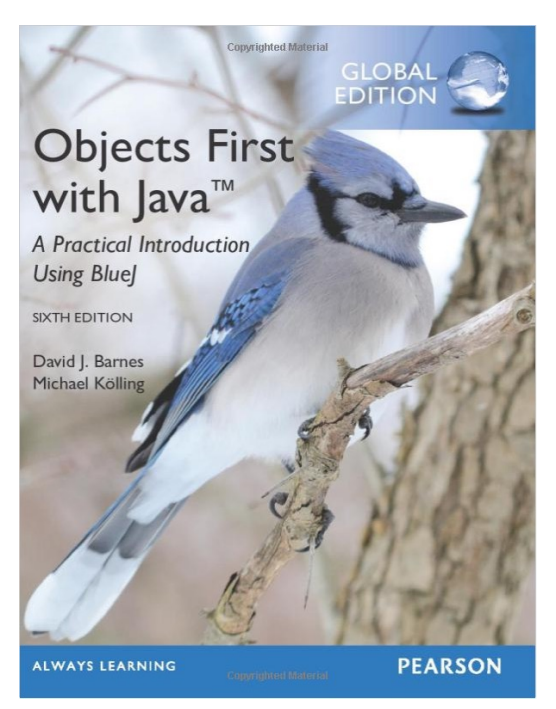
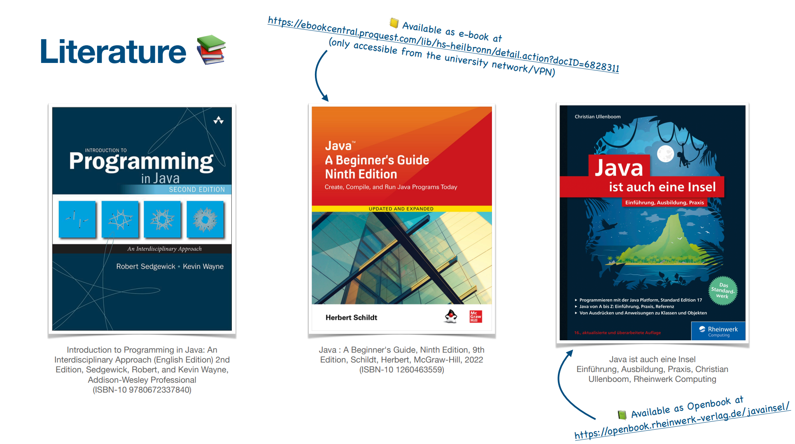

# Introduction & Organization 

Interactive Programs

Prof. Dr.-Ing. Andreas Heil

---

<!-- style: "text-align: center;" -->

# Welcome ♥

---

## Motivation

“Programming is the art of telling another human being what one wants the computer to do.”

― Donald Ervin Knuth

---

## Team

- Prof. Dr.-Ing. Andreas Heil (👨‍🏫)
  andreas.heil@hs-heilbronn.de

- Dr. Jasmin Buck (Teaching Assistant)
  jasmin.buck@hs-heilbronn.de

- Frank Mayer, Nils Stumpfe (Tutor)

---

# Introduction 

Before we start, lets introduce each other...

---

## The I-am-so-fabulous-slide 

- Professor since 2019
- Focus on agile methodologies, DevOps, software development, software engineering and software architecture in generals
- PhD in Web Engineering from Chemnitz University of Technology 
- Dipl.-Inform. from of Karlsruhe University of Technology (KIT) FKA Universität Karlsruhe (TH) in the subject software engineering and telematics

---

## There is more to tell about

- Java developer at the KIT, Karlsruhe
 - Developer at Campana & Schott, Frankfurt
 - Microsoft Research Software Developer at Microsoft Research Cambridge, UK 
 - Senior Developer at STP AG, Karlsruhe
 - Development lead at REALTECH AG, Walldorf
 - EAI architect at dm drogerie-markt, Karlsruhe
 - Author for dotnetpro an Web & Developer

---
 
## Where it began

- Started with programming in the age of 9 learning BASIC on a Commodore C64, continued AmigaBASIC on a Commodore Amiga 500 
- BASIC, Assembler, Pascal on x86, followed by Visual Basic, Visual C++, Delphi on Windows, Java (1.0!), .NET (1.0), JavaScript etc.
- Wrote code in LISP, MIPS, scripting languages and many other languages, wrote even my own compiler and developed a few languages language but forgot most of it

--- 

## But to be honest 

- I do google how to initialize an array on a regular base (you will understand at the end of this course)
- I can`t run a Java program without looking up on the web
- If I look at code I wrote several years ago, I wonder that I was able to do so at all
- I run this course the very first time, eventually I am more nervous than you! 

--- 

## Introducing your turn

---

# Organisation

How we try to run this course...

---

## Workload

- Lectures and practical exercises hours (every monday)
- As a rule, lectures are in presence
- 6 SWS, 8 ECTS 
  - 1 ECTS is about 30h of effort 
  - 8 ECTs ~ 240h
  - 16-20 hours per week! 
  - Use it or lose it!

---

## Practicing is inevitable

- Skill comes with practice 
- You learn programming only by writing and compiling code by yourself 
- What you learn here will be needed all subsequent courses 

---

## Time Management 

- Optimize your time management and schedule practice times 
- You will...
  - ... spend a lot of time alone on independent practice 
  - ... also spend time together (pair programming) so solve problems 
  - ... experience quite some times with a lot of frustration
  - ... spend a lot of time debugging things and getting frustrated (your entire career, tbh)  
- Wee will support you in overcoming your frustration 

---

## What will you be after the course 
- You will...
  - ... be able to tell a computer what to do by programming it!
  - ... be able to implement simple functionality in Java 
  - ... understand the concepts of object-oriented programming 
  - ... be able to use the Java class library 
  - ... be able to document your code (in a meaningful way)
  - ... be able to detect errors by debugging your code

---

# Learning Concepts 

How we learn together...

---

## Lectures

Mondays will be structured as following:

a) Lectures, introduction new topics
b) Live Coding (and probably live fails alike 😁)
c) Practicing by yourself 
d) continue with a)

---

# Learning Concepts 

Mondays will be structured as following:

a) Lecture as introduction to topics
b) Live Coding an probably live fails alike
c) Practicing by yourself 
d) Continue with a)

Wow! We just implemented our first program. But how do we know to stop?

---

# Learning Concepts - Refined

Mondays will be structured as following:

While not 4:45 pm do
&nbsp;&nbsp;&nbsp;&nbsp;a) Lecture as introduction to topics
&nbsp;&nbsp;&nbsp;&nbsp;b) Live Coding an probably live fails alike
&nbsp;&nbsp;&nbsp;&nbsp;c)Practicing by yourself 
&nbsp;&nbsp;&nbsp;&nbsp;d) Continue with a)

Wow! We just created our first loop. 👌

---

## How do we support you?

- During Monday Dr. Buck and myself will support you during the exercise slots 
 
- Weekly exercises, automatically or manually checked including feedback

- There will be quizzes in ILIAS

- Microsoft Teams chat

- Our goal is to teach you programming and making programming fun

---

## Grading 

- Presence is mandatory (80% required)
- Quizzes
- Exercises
  - 50% of the points needed to take part in the exam
  - &gt; 80% of the points : 0,3 grade improvement if you passed the tests
- 2 ILIAS-Tests 
  - 2. Test has to be passed to pass the course 
  - Both tests have to be > 4,0 to pass the course 

---

# Preparation (now)

What to do now...

- Sign up at the ILIAS course 
  - [https://t.ly/kIy2e](https://ilias.hs-heilbronn.de/ilias.php?baseClass=ilrepositorygui&ref_id=844656)  

- Sign up for the Microsoft Teams 
[https://t.ly/_aRgb](https://teams.microsoft.com/l/team/19%3AKCiR-sH987yg1NGGTFXJ8Qp8idZ7okNRO1yiGVbaNcg1%40thread.tacv2/conversations?groupId=1b7b271d-5a88-45c7-bf32-c6b151344767&tenantId=fe73884d-8d6f-4d22-94ac-b1d52fd5495f) 

---

# Preparation (homework)

Until monday, follow the kick off instructions in ILIAS

- Install the editor (Visual Studio Code)
- Install Java
- Write and compile your first program 

If you run into any trouble use the teams chat, if you can help others in the chat, do so! 

---

# Literature

The exercises are based on the following book

---

# Further Literature

---

# AI Assistance

Meanwhile, there are many tool based on artificial intelligence
  - ChatGPT
  - GitHub Copilot
  - Google Bard
  - Code Whisperer

Do not use those tools for solving your exercises. However, you can use those tools to let you explain things, especially, let them explain existing code. We will cover this in the lectures.

---

# Questions?
